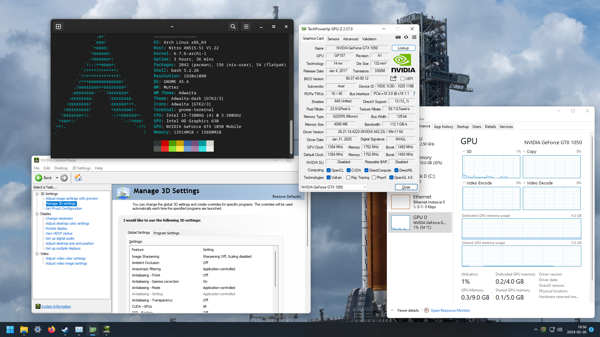

# VFIO GPU passthrough

This repository contains the information about my experiments on GPU passthrough using VFIO.



## Host specification

The host is a laptop with NVIDIA Optimus with an NVIDIA Pascal GPU.

- Model: Acer Nitro 5 AN515-51
- CPU: Intel Core i5-7300HQ
- GPU:
    - Intel HD Graphics 630
    - NVIDIA Geforce GTX 1050 Mobile 4GB
- RAM: 16 GB
- OS: Arch Linux

## Workarounds

Diffrent systems usually needs different workarounds, or need none of them at all. The one listed
below are workarounds that I use for my system, sorted from common to uncommon.

### Disable fast boot

For debugging, it would be better to disable fast boot since it will make the system retains states
that might be inconsistent of changes you made.

### Using the latest driver

Some of the workarounds, such as the fake battery table and hiding KVM, might not be needed on
newer NVIDIA drivers.

### Standard Code 43 fixes

Refer to the Arch Linux wiki:
https://wiki.archlinux.org/title/PCI_passthrough_via_OVMF#Video_card_driver_virtualisation_detection.

### Custom ACPI SSDT

The SSDT in this repository included a fake battery and ACPI ROM workarounds. You can add it using
QEMU `-acpitable` parameter.

#### ACPI ROM

Some systems did not have ROM exposed as a PCI BAR, instead supplied it using ACPI `_ROM` method
instead. More info on this:
https://github.com/jscinoz/optimus-vfio-docs/issues/2.

The SSDT included here will looking up the ROM in a QEMU fw_cfg file named
`opt/com.lion328/nvidia-rom`. This needed to be specified in libvirt XML like this:

```xml
<domain xmlns:qemu="http://libvirt.org/schemas/domain/qemu/1.0">
    ...
    <sysinfo type="fwcfg">
        <entry name="opt/com.lion328/nvidia-rom" file="/path/to/rom"/>
    </sysinfo>
    <qemu:commandline>
        ...
        <qemu:arg value="-acpitable"/>
        <qemu:arg value="file=/path/to/ssdt_loading_rom.aml"/>
    </qemu:commandline>
</domain>
```

From my testing, drivers will not mind having GPU in different location than the host, they only
need `_ROM` method to be present in the same location.

#### Fake battery

NVIDIA drivers might also check for the existence of a battery. More info on this:
https://www.reddit.com/r/VFIO/comments/ebo2uk/nvidia_geforce_rtx_2060_mobile_success_qemu_ovmf/.

The SSDT included here is a bit different. In guest, it will show up as the battery missing instead
of having a fully-charged battery. This needed to be specified in libvirt XML like this:

```xml
<domain xmlns:qemu="http://libvirt.org/schemas/domain/qemu/1.0">
    ...
    <qemu:commandline>
        ...
        <qemu:arg value="-acpitable"/>
        <qemu:arg value="file=/path/to/ssdt_fake_battery.aml"/>
    </qemu:commandline>
</domain>
```

**Note:** from my testing on Windows 11, If you use this workaround, when holding down keys (e.g.
holding W key to go forward in games,) the left click will not be registered. Likely because
Windows think the mouse is some kind of a touchpad since there is a battery, so it will disable the
"touchpad" if the user is using the keyboard. Windows, however, didn't provide any facilities to
configure touchpads, so there is no way (from what I can tell) to disable such behavior. Only PS/2
and virtio kind of mouses are affected. A workaround of this is specify the mouse to use USB instead.
Or don't use the fake battery at all.

### Not passing through the HDMI Audio

Somehow passing the HDMI audio part of GPU can result in Code 43. Do not let vfio-pci bind to it
since it is in the same IOMMU group and vfio-pci will do something to it even without passing it
to VM. I set `driver_override` to `none` to prevent it from automatically bind to anything.
Binding it to `pci-stub` also works.

### Reset GPU from host

This is very hacky and I will not recommend it since most systems usually already works with other
workarounds. The procedure is basically:

1. Power off GPU
2. Power on GPU
3. Unload modules that rely on NVIDIA (e.g. NVIDIA driver, bbswitch)
4. Remove NVIDIA graphics and audio devices and their parent from the PCI bus
5. Rescan PCI bus
6. Load NVIDIA driver
7. Run `nvidia-smi --gpu-reset`

Linux guests usually works without it. This also can be done in a Linux guest by booting in to it
first and then reboot into Windows (this is how I discovered the workaround.) Running on the host
is easier, however.

I do not think that every steps are necessary, but it is what I ended up with. There are also
problems with the GPU state after using it in VM, resulted in the host unable to load NVIDIA
driver, thus can not execute procedure properly.

## Alternate workaround

Using an MXM ROM of the same GPU in PCI ROM BAR removes the need for the GPU reset workaround. It
also enable the usage of HDMI audio. I hate that it relies on some random ROM though. The ROM I
used came from here: https://www.techpowerup.com/vgabios/219078/219078.

## Non-critical fixes

These are not required in most (if not all) cases. If you got the code 43 error, I do not think
these will fix it, but I think it is still nice to list them here.

### Set PCI subsystem vendor and device IDs

The PCI subsystem vendor and device IDs is normally set to zero. Real devices usually have
different values, which did not get passed through for a reason I do not know.

Without this, Windows might not be able to automatically download and install the GPU driver. The
GPU should work fine if you installed the driver manually, so it is not absolutely necessary.

Here an example of the fix for libvirt:

```xml
<domain xmlns:qemu="http://libvirt.org/schemas/domain/qemu/1.0">
    ...
    <qemu:override>
        <qemu:device alias="hostdev0">
            <qemu:frontend>
                <qemu:property name="x-pci-sub-vendor-id" type="unsigned" value="4133"/>
                <qemu:property name="x-pci-sub-device-id" type="unsigned" value="4491"/>
            </qemu:frontend>
        </qemu:device>
    </qemu:override>
</domain>
```

Where `hostdev0` is the reference to the GPU device passed through. The number is the index of
`hostdev` tag in XML counted from top to bottom. `4133` and `4491` equals to hexadecimal `0x1025`
and `0x118b` respectively, which corresponds to the subsystem vendor and device IDs. You can find
the value of your GPU with `lspci -nnk`. An example output:

```
...
01:00.0 VGA compatible controller [0300]: NVIDIA Corporation GP107M [GeForce GTX 1050 Mobile] [10de:1c8d] (rev a1)
	Subsystem: Acer Incorporated [ALI] GP107M [GeForce GTX 1050 Mobile] [1025:118b]
	Kernel modules: nouveau, nvidia_drm, nvidia
...
```

### Mirror PCI hierarchy of the GPU

An example output of `lspci -tv`:

```
-[0000:00]-+-00.0  Intel Corporation Xeon E3-1200 v6/7th Gen Core Processor Host Bridge/DRAM Registers
           +-01.0-[01]--+-00.0  NVIDIA Corporation GP107M [GeForce GTX 1050 Mobile]
           |            \-00.1  NVIDIA Corporation GP107GL High Definition Audio Controller
           +-02.0  Intel Corporation HD Graphics 630
            ...
```

Starting at the GPU:

1. The device is at `00.0` or device 0 function 0 of the parent.
2. The device is in `[01]` or bus 1, thus having the address of `01:00.0`.
3. The parent of the bus 1 is at `01.0` or device 1 function 0 of the parent.
4. The device at `01.0` is in `[0000:00]` or domain 0 bus 0, thus the GPU is at `0000:01:00.0` or
   domain 0 bus 1 device 0 bus 1.

In libvirt, this equals to `pcie-root-port` placed at `01.0`. It must not have any root ports or
anything that resulted in a new bus before `01.0` address, so that the bus number of `01.0` will be
1\. Then you just set address of the GPU device to `01:00.0`.

For more information see https://libvirt.org/pci-addresses.html and
https://gitlab.com/qemu-project/qemu/-/blob/master/docs/pcie.txt.

### Disable hotplugging

NVIDIA driver will try to call ACPI methods, for example, `_ROM` and `_DSM`. The driver will try to
skip them if not found. This repository's SSDT implemented `_ROM` only. However, if the device is
hotplugable (which it is by default,) QEMU will insert `_DSM` along with others and the driver will
try to call it. This will cause only some warning since the arguments passed by the driver are not
what QEMU expected.

The fix is by adding `hotplug="off"` to the root port of the GPU. An example:

```xml
<domain>
    ...
    <devices>
        ...
        <controller type="pci" index="1" model="pcie-root-port">
            ...
            <target chassis="1" port="0x18" hotplug="off"/>
        </controller>
    </device>
</domain>
```

## Tips and tricks

### Try both Linux and Windows in guest

Each OS have its own quirks. Linux guests can be more forgiving. If it did not work in Linux, then
it is probably not working for Windows guest either. Keep in mind that there are some cases where
it works on Windows but not on Linux, so testing both Linux and Windows if you can. 

### Reset the NVRAM

If the VM stuck on the POST screen, try resetting the NVRAM by deleting it. For libvirt, the file
resides at `/var/lib/libvirt/qemu/nvram/`.

## Wishlist

- Working HDMI audio without the MXM ROM
- Working system without GPU reset workaround or the MXM ROM

## Other stuff

### A tool for dumping GPU ROM from ACPI

`dump_vbios_rom_acpi` is a tool for dumping GPU ROM directly from ACPI. This requires `acpi_call`
kernel module to be installed and loaded. The script will try to find the ACPI path of the
specified PCI device (01:00.0 as default) and execute `_ROM` method.

For example, this command will dump the ROM of a PCI device at 01:00.0 to `rom.bin`:

`./dump_vbios_rom_acpi --device 0000:01:00.0 > rom.bin`

## Useful tutorials

https://lantian.pub/en/article/modify-computer/laptop-intel-nvidia-optimus-passthrough.lantian/

https://gist.github.com/Misairu-G/616f7b2756c488148b7309addc940b28
